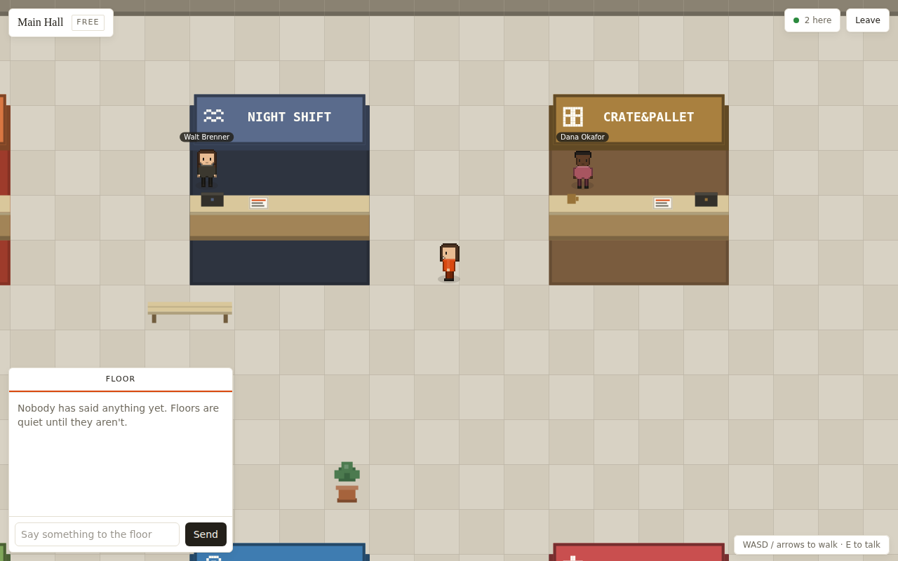

# FounderFloor

A walkable 2D expo floor for startups. Each floor is a small tile-map hall with
booths; founder NPCs stand at their booths and answer keyword-matched questions
in DMs, other visitors show up as live avatars over WebSocket, and "Connect"
files a contact into your profile. Ranks hang on verified monthly revenue, not
vibes. Next.js 14 (app router) on the front, a plain `ws` room server on the
back, canvas 2D for the world — no game engine, no sprite assets, everything is
drawn procedurally at init.



## Quickstart

```bash
npm install
npm run dev
```

Two ports: the web app on **http://localhost:3000** and the WebSocket floor
server on **:3001** (`PORT_WS` overrides it). `npm run dev` starts both via
concurrently; `npm run dev:web` / `npm run dev:ws` start them separately.
`npm run typecheck` and `npm run build` do what they say.

If the floor server is down the game still runs — you get a "solo preview"
badge and NPC founders only.

## Controls

- **WASD / arrow keys** — walk
- **E or Enter** — talk to the booth you're near (a `!` bubble and an "E — talk
  to" hint appear); clicking a nearby booth works too
- Chat panel (bottom left): **Floor** tab broadcasts to everyone on the floor,
  the DM tab talks to the founder whose booth you opened
- Typing in any input suspends movement keys

## Architecture

| Path | Owns |
| --- | --- |
| `lib/types.ts` | Every shared contract. All modules compile against this file; it imports nothing. |
| `lib/data/floors.ts` | The four floor definitions: tile size, theme, 4x3 booth spots (+1-tile apron), tier gates, the reserved spot for your booth. |
| `lib/data/startups.ts` | 25 seed startups with booth themes and keyword-matched dialogue; `replyFor()` picks NPC replies. |
| `lib/ranks.ts` | Revenue → rank table (`Garage` … `Escape Velocity`). |
| `lib/store.ts` | SSR-safe localStorage store (`useAppState`): profile, subscription tier, connections, your startup. |
| `lib/net.ts` | Browser WebSocket client implementing `NetClient`; silently degrades to offline single-player, 2 reconnect attempts on drops. |
| `server/index.mjs` | Standalone `ws` room server: rooms keyed by floor id, join/move/chat relay, rate limiting, heartbeat. In-memory only. |
| `game/engine.ts` | Render loop, input, collision, camera, movement packets, remote-player interpolation, booth proximity. |
| `game/tilemap.ts` | FloorDef → collision grid + draw lists: walls, checker floor, booth stalls, seeded ambient props. |
| `game/sprites.ts` | Procedural pixel avatars (skin/outfit/hair palettes), booth glyphs, color utilities. |
| `game/npc.ts` | Founder NPCs: fidget near their counter, face you when you approach. |
| `app/` | Routes: landing, `/lobby` (floor picker + first-visit onboarding), `/floor/[id]` (the game + HUD), `/profile` (identity, booth editor, verification, membership, connections). |
| `components/` | HUD and form pieces: BoothCard, ChatPanel, AvatarPicker, RankBadge, TierTag, Toast, pixel glyph/logo. |

## Demo simplifications (and the production path)

- **In-memory rooms** — the ws server keeps rooms in a `Map` and forgets
  everything on restart; production would move room state to Redis pub/sub so
  multiple server nodes share floors and survive deploys.
- **localStorage persistence** — profile, connections, tier and your booth
  live under one localStorage key on the device; production would keep
  profiles in Postgres behind real accounts.
- **Simulated revenue verification** — the profile page lets you type a
  number and calls it verified; production is read-only revenue verification
  via Stripe Connect, so the rank badge reflects charges Stripe actually saw.
- **Simulated subscriptions** — the tier switcher just writes to the store;
  production would put Pro/Founder+ on Stripe Billing and gate floors off the
  subscription status webhook.

## What to build next

- Player-to-player DMs (the plumbing exists; only NPC DMs have UI).
- Your booth on other people's screens — booths are local-only today, which is
  the biggest lie the demo tells.
- Persist floor chat history per room (currently vanishes on leave).
- Spatial audio-style chat fading by distance, since positions already relay.
- Booth analytics for owners: visits, chats, connects.
- Moderation basics before any of this meets the public internet: name
  filtering, mute, report.
